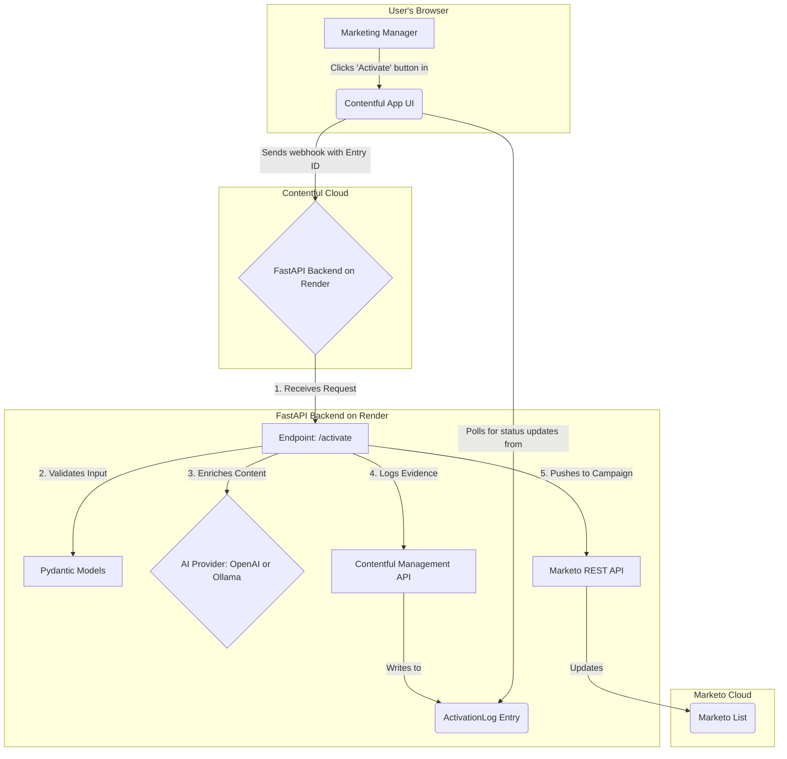

# AI Content Activation Engine for Marketing Operations

**A functional prototype designed to demonstrate the skills required for the Contentful AI Engineer, Marketing Ops role.**

**Status:** `[Phase 1: MVP - Core Implementation Complete]`

---

### Introduction: From Governance to a Self-Improving AI

I built this project to translate 20 years of enterprise content governance experience into a solution for modern AI-powered marketing operations. The core thesis is that trustworthy AI in the enterprise isn't just about better prompts; it's about creating auditable, repeatable, and *self-improving* workflows—principles learned from two decades of rolling out enterprise CMS platforms.

This tool is a functional prototype that demonstrates how to apply that governance mindset to increase marketing velocity and impact safely.

### The Problem: The Static AI Tool & The Manual Marketing Bottleneck

Marketing teams are often stuck with two bad options: time-consuming manual work or "black box" AI tools that don't learn and can't be trusted. As a Marketing Ops Manager, the pain is clear:

> "I want to have my content automatically tagged with relevant keywords and summarized for different channels, so that I can reduce the manual pre-launch checklist for every campaign and activate content faster. But I also need to see a complete audit trail for every piece of content an AI has touched, so that I can trust our systems and debug issues quickly."

### The Solution: An AI Activation Engine with a Learning Loop

This tool is a Contentful App that connects directly to a custom FastAPI backend. It allows a marketing manager to enrich and syndicate content to Marketo with a single click, automating the most repetitive parts of campaign preparation.

It has two functions:
1. **Immediate Value:** It enriches content with summaries and tags, pushing it to Marketo to accelerate campaigns.
2. **Long-Term Value:** It captures every interaction as structured data, creating the foundation for a learning loop that makes the AI smarter, cheaper, and more aligned with the company's voice over time.

### Live Demo & Interactive Access

The 30-second video below shows the end-to-end workflow in action, from a plain article to an enriched, campaign-ready asset.

**(A live demo GIF of the end-to-end workflow will be placed here.)**

For a hands-on, interactive demo where you can trigger the AI workflow yourself, please request access. I will provide you with temporary credentials to the Contentful space and a guide to running your own test.

**[Request Interactive Demo Access](mailto:ed@adambalm.io?subject=Request%20for%20Interactive%20Project%20Demo%20Access)**
### The Governance Connection: The `ActivationLog` as a Dual-Use Asset

This system is designed for enterprise realities, where trust and auditability are non-negotiable. The `ActivationLog` is the key.

* **For Managers (The Audit Trail):** The log provides a clear, immutable record for governance. It's the modern equivalent of the audit-friendly publishing workflows I designed for enterprise CMS platforms, providing a clear answer to "What did the AI do and why?"

* **For Engineers (The Training Dataset):** Every log entry is a high-quality, Pydantic-validated piece of data formatted as a "prompt-response pair." This log is not just a record; it is the raw material (`JSONL`) for a future Supervised Fine-Tuning (SFT) pipeline that will continuously improve the model.

### Technical Architecture

The system uses a decoupled architecture to ensure scalability and maintainability. The Contentful App acts as the user interface, triggering a Python-based backend that orchestrates the AI and MarTech integrations.

#### Provider-Agnostic Architecture Implementation

The system implements flexible provider patterns for both AI services and marketing platforms:

**AI Services:**
- **OpenAI Provider**: Production-ready integration with GPT models
- **Local Model Provider**: Cost-effective development using Ollama (llama3.2, qwen2.5-coder, deepseek-r1)
- **Environment-Based Switching**: `AI_PROVIDER=openai|local` configuration
- **Validated Integration**: 12 test cases covering both providers with schema compliance

**Marketing Platforms:**
- **Marketo Service**: Enterprise marketing automation integration
- **HubSpot Service**: Accessible alternative with free tier
- **Mock Service**: Development/testing fallback with realistic response simulation
- **Unified Interface**: Async adapter pattern ensures consistent API across all platforms

**Quality Assurance:**
- **Comprehensive Testing**: 23 test cases (18 passing, 5 with known service naming issues)
- **Pre-commit Hooks**: Automated code quality with ruff, black, and pytest
- **Schema Validation**: Pydantic models ensure data integrity across all integrations



### System Maturity & Implementation Status

**Current Implementation**: Mixed maturity levels with strategic focus on core portfolio demonstration capabilities.

#### 🟢 Production-Ready Components
- **FastAPI Backend**: 199 lines of production code with comprehensive error handling
- **Pydantic Validation**: Complete controlled vocabulary system (25+ marketing tags)  
- **Activation Logging**: JSONL audit trail with 142+ real activation logs captured
- **AI Service Factory**: OpenAI and Ollama providers with graceful fallbacks

#### 🟡 Partially Complete Features (70-85% Implementation)
- **AI Enrichment**: Meta descriptions and keyword generation working
  - ❌ **Missing**: Vision model integration for automated alt text generation
  - **Impact**: Cannot address 26% industry accessibility compliance gap
- **Provider Architecture**: Clean abstractions implemented
  - ❌ **Missing**: gpt-4o vision API and Qwen 2.5VL 7b integration

#### 🔴 Critical Gaps Requiring Implementation
- **ContentfulService**: Currently returns mock data only
  - **Impact**: Prevents live demonstration with real client content
  - **Priority**: CRITICAL - Required for meaningful evaluation
  - **Estimate**: 12-16 hours for live integration
  
- **Marketing Platform APIs**: Functional mock services, stub implementations for real APIs
  - **Impact**: Cannot complete full content-to-campaign workflow
  - **Priority**: MEDIUM - Mock services sufficient for core demonstration

#### Architecture Documentation
For detailed component analysis and development roadmap:
- **[Technical Specification](.agent-os/product/technical-spec.md)** - Complete component maturity assessment
- **[Dependency Map](.agent-os/product/dependency-map.md)** - Critical path analysis and integration points
- **[Agent Specialization Roadmap](.agent-os/product/agent-specialization-roadmap.md)** - Scaling strategy for complex development

### The Living Roadmap: From Activation to True Learning

This project is built to evolve, just like a real-world enterprise system.

* **Phase 1 (This MVP):** The Activation Engine & Data Collection.
* **Phase 2 (Vision):** A Proactive Content Supply Chain (Webhook-driven, multi-variant generation).
* **Phase 3 (Vision):** The Fine-Tuning Pipeline (SFT) & Impact Dashboard.

### Setup & Installation

#### Prerequisites
- Python 3.10+
- Git
- Node.js (for Contentful App development)

#### Backend Setup
```bash
# Clone repository
git clone <repository-url>
cd contentful-marketo-ai-bridge

# Set up backend environment
cd backend
python -m venv .venv
source .venv/bin/activate  # On Windows: .venv\Scripts\activate
pip install -r requirements.txt

# Install pre-commit hooks (required for development)
pre-commit install

# Copy environment template and configure
cp ../.env.template .env
# Edit .env with your API keys and AI provider preference:
#   AI_PROVIDER="openai" for OpenAI GPT models (requires OPENAI_API_KEY)
#   AI_PROVIDER="local" for Ollama local models (requires Ollama running)

# Run tests
pytest tests/

# Start development server
uvicorn main:app --reload
```

#### Containerized Deployment

Build and run with Docker:

```bash
cd backend
docker build -t content-activation-backend .
docker run -p 8000:8000 \
  -e AI_PROVIDER=openai \
  -e MARKETING_PLATFORM=mock \
  -e ACTIVATION_LOG_PATH=/var/log/activation_logs.jsonl \
  content-activation-backend
```

Render one-click deploy (example `render.yaml` provided at repo root):

```yaml
services:
  - type: web
    name: content-activation-backend
    env: docker
    rootDir: backend
    dockerCommand: uvicorn main:app --host 0.0.0.0 --port 8000
    healthCheckPath: /health
```

The backend appends every activation response to a JSON Lines log controlled by `ACTIVATION_LOG_PATH` (default `activation_logs.jsonl`).

#### Development Workflow
This repository uses automated quality gates to ensure code quality:

- **Pre-commit hooks:** Run automatically on every commit
  - `ruff`: Code linting and error detection
  - `black`: Automatic code formatting
  - `pytest`: Complete test suite execution
- **Emergency bypass:** Use `git commit --no-verify` only in emergencies
- **All tests must pass** before code can be committed

The pre-commit hooks ensure consistent code quality and prevent broken code from entering the repository.
