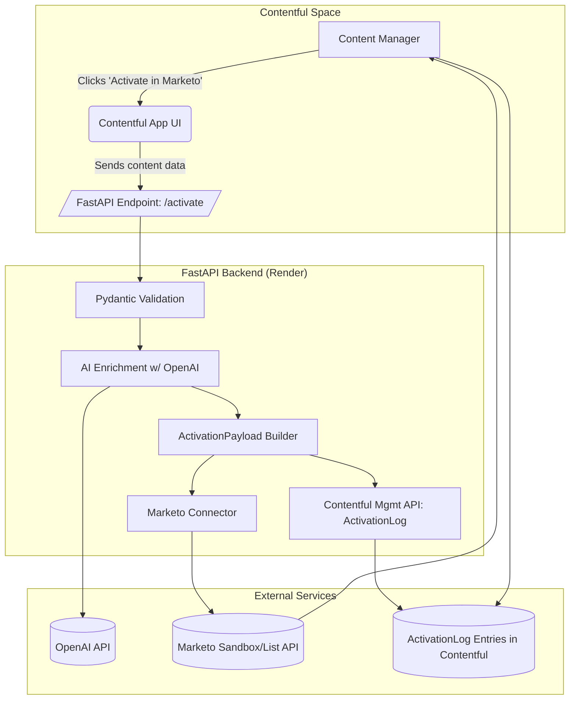

# Portfolio Project: Marketing Activation Engine

AI-powered content governance and marketing activation (Contentful → FastAPI → Marketo).

## Overview

This project bridges content management and marketing automation by intelligently processing content from Contentful and seamlessly activating it in Marketo campaigns. Designed for Marketing Operations teams who need to scale content activation while maintaining brand consistency and governance standards. Ed's background in CMS governance meets modern AI-powered marketing workflows to create a reliable, auditable activation pipeline.

## Architecture Diagram

## User Stories

See [docs/USER_STORIES.md](docs/USER_STORIES.md) for detailed user stories framed from a Marketing Ops Manager's perspective.

## Getting Started

1. Clone repo
2. Copy `.env.template` → `.env` and add Contentful, Marketo, and OpenAI keys
3. Install backend dependencies: `cd backend && pip install -r requirements.txt`
4. Run FastAPI: `uvicorn main:app --reload`
5. Scaffold Contentful App: `npx create-contentful-app contentful-app`

## Roadmap

See [docs/MVP_ROADMAP.md](docs/MVP_ROADMAP.md) for the complete development plan. Phase 1 = MVP, Phase 2 = webhooks & multi-variant generation, Phase 3 = dashboards.

## License

MIT License