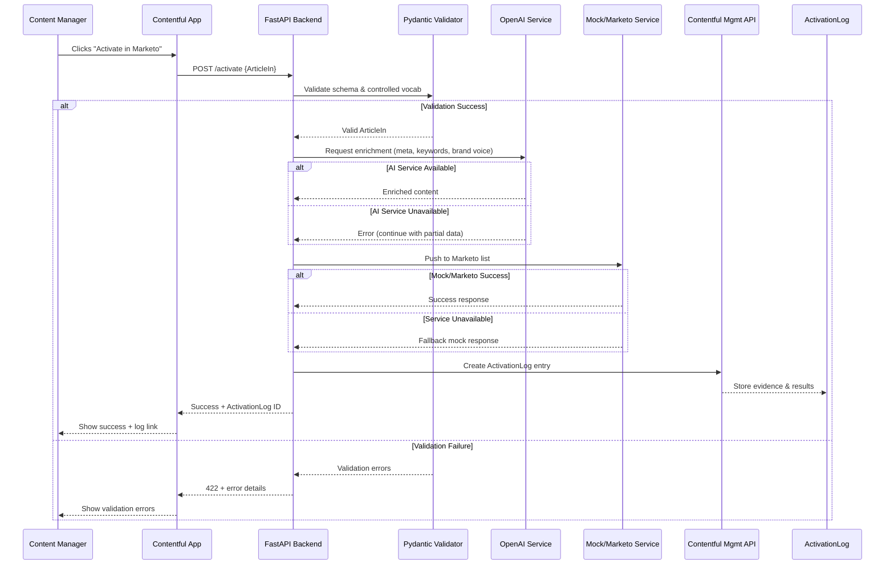

# Technical Specification: Marketing Activation Engine

## Overview

The Marketing Activation Engine bridges content management (Contentful) and marketing automation (Marketo) through AI-powered enrichment and validation. This system addresses the industry problem where 35% of sites lack meta descriptions, 26% miss alt text, and 60-70% of content remains unused due to poor metadata.

**Architecture:** Contentful App → FastAPI Backend → OpenAI Enrichment → Marketo Integration + ActivationLog Evidence

**MVP Scope:** Manual trigger workflow with validation, enrichment, list membership updates, and comprehensive audit logging.

## Success Metrics

- Reduce activation cycle from 2–3 days to ≤8 hours.
- Ensure 100% of activated entries include meta descriptions (industry gaps: ~35% missing, ~50% duplicates).
- Position content for 5.8–30% potential CTR lift by enforcing correct meta description length and quality.
- Guarantee controlled vocabulary tagging for campaign_tags (addresses 60–70% unused content problem tied to poor metadata).
- Ensure alt text is present for any image-bearing article (addresses ~26% missing alt text on the web).
- Create an ActivationLog for every activation capturing validation results, AI outputs, brand voice advisories, and integration results.

## System Flow



---

## System Components

### 1. Contentful App (Frontend UI)
- **Purpose:** Provides "Activate in Marketo" button and status display within Contentful's sidebar
- **Technology:** React-based Contentful App SDK
- **Key Functions:**
  - Trigger activation via FastAPI `/activate` endpoint
  - Display latest ActivationLog status and results
  - Handle loading states and error notifications

### 2. FastAPI Backend (Orchestration Layer)
- **Purpose:** Orchestrates validation → enrichment → activation → logging workflow
- **Technology:** Python FastAPI with async request handling
- **Key Functions:**
  - `/activate` endpoint accepting ArticleIn payloads
  - Chain multiple services: Pydantic validation, OpenAI enrichment, Marketo push, evidence logging
  - Error handling with fallback to mock services

### 3. Pydantic Schemas (Data Validation)
- **Purpose:** Enforce semantic validation beyond Contentful's type checking
- **Technology:** Pydantic v2 with custom validators
- **Addresses PRD Gap:** Contentful cannot enforce marketing-specific rules (title length, controlled vocabulary, completeness)

### 4. OpenAI Enrichment Service
- **Purpose:** Generate meta descriptions, keywords, brand voice analysis, alt text
- **Technology:** OpenAI API with structured prompting
- **Addresses PRD Gap:** Contentful lacks automated content enrichment and brand consistency checking

### 5. Contentful Management API Integration
- **Purpose:** Create ActivationLog entries with AI outputs and validation results
- **Technology:** Contentful Management API SDK
- **Addresses PRD Gap:** Provides audit trail of AI decision-making that Contentful doesn't natively support

### 6. Marketo Connector
- **Purpose:** Push validated content to Marketo lists (**MVP scope: list membership only; campaign creation and lead scoring deferred**)
- **Technology:** Marketo REST API with OAuth authentication
- **Addresses PRD Gap:** Contentful cannot directly integrate with marketing automation platforms

---

## Data Contracts

### ArticleIn Schema
```python
from pydantic import BaseModel, Field, validator
from typing import List, Optional

class ArticleIn(BaseModel):
    title: str = Field(..., max_length=70, description="SEO-optimized title")
    body: str = Field(..., min_length=100, description="Main content body")
    summary: Optional[str] = Field(None, max_length=160, description="Optional existing summary")
    campaign_tags: List[str] = Field(..., min_items=1, description="Tags from controlled vocabulary")
    alt_text: Optional[str] = Field(None, description="Image alt text for accessibility (required if images present)")
    has_images: bool = Field(False, description="Whether article contains images")
    cta_text: Optional[str] = Field(None, max_length=80, description="Call-to-action text")
    cta_url: Optional[str] = Field(None, description="Call-to-action URL")
    content_type: str = Field("article", description="Content type identifier")

    @validator('campaign_tags')
    def validate_controlled_vocabulary(cls, v):
        # Comprehensive controlled vocabulary taxonomy
        allowed_tags = {
            # Content Types
            "product-launch", "thought-leadership", "case-study", "webinar", "ebook",
            "release-notes", "tutorial", "whitepaper", "demo", "blog-post",
            # Audience Segments
            "developer", "marketer", "enterprise", "startup", "technical-decision-maker",
            "content-creator", "product-manager", "executive",
            # Funnel Stages
            "awareness", "consideration", "decision", "retention", "advocacy",
            # Campaign Types
            "demand-gen", "brand-awareness", "product-adoption", "customer-success",
            "lead-nurture", "competitive-intelligence"
        }
        invalid_tags = set(v) - allowed_tags
        if invalid_tags:
            raise ValueError(f"Invalid tags: {invalid_tags}. Must use controlled vocabulary: {sorted(allowed_tags)}")
        return v

    @validator('alt_text')
    def validate_alt_text_when_images_present(cls, v, values):
        has_images = values.get('has_images', False)
        if has_images and not v:
            raise ValueError("Alt text is required when article contains images")
        return v

    @validator('cta_url')
    def validate_cta_url_format(cls, v):
        if v and not v.startswith(('http://', 'https://')):
            raise ValueError("CTA URL must be a valid HTTP/HTTPS URL")
        return v
```

### ActivationPayload Schema
```python
class ActivationPayload(BaseModel):
    title: str
    meta_description: str = Field(..., max_length=160)
    keywords: List[str] = Field(..., min_items=3, max_items=7)
    campaign_tags: List[str]
    brand_voice_analysis: dict = Field(..., description="Categorical brand voice results")
    cta_text: Optional[str] = Field(None, max_length=80)
    cta_url: Optional[str] = Field(None)
    marketo_list_id: str
    activation_timestamp: str

    @validator('campaign_tags')
    def map_controlled_vocabulary(cls, v):
        # Map or drop invalid tags with logging
        allowed_tags = {
            "product-launch", "thought-leadership", "case-study", "webinar", "ebook",
            "release-notes", "tutorial", "whitepaper", "demo", "blog-post",
            "developer", "marketer", "enterprise", "startup", "technical-decision-maker",
            "content-creator", "product-manager", "executive",
            "awareness", "consideration", "decision", "retention", "advocacy",
            "demand-gen", "brand-awareness", "product-adoption", "customer-success",
            "lead-nurture", "competitive-intelligence"
        }
        # Map invalid tags to nearest valid or drop them
        mapped_tags = [tag for tag in v if tag in allowed_tags]
        if len(mapped_tags) != len(v):
            dropped = set(v) - set(mapped_tags)
            # This would be logged in ActivationLog in actual implementation
            print(f"Advisory: Dropped invalid tags {dropped} from outbound payload")
        return mapped_tags

    @validator('cta_url')
    def validate_cta_url_format(cls, v):
        if v and not v.startswith(('http://', 'https://')):
            raise ValueError("CTA URL must be a valid HTTP/HTTPS URL")
        return v
```

### ActivationLog Schema
```python
class ActivationLog(BaseModel):
    article_reference: str = Field(..., description="Contentful entry ID")
    activation_timestamp: str
    ai_outputs: dict = Field(..., description="Raw AI enrichment results")
    validation_results: dict = Field(..., description="Pydantic validation outcomes")
    marketo_response: dict = Field(..., description="Marketo API response or mock data")
    status: str = Field(..., regex="^(draft|processing|completed|failed)$")
    brand_voice_analysis: dict = Field(..., description="Contentful brand heuristics results")
```

---

## AI Enrichment Details

### Meta Description Generation
- **Input:** Article title + body summary
- **Output:** SEO-optimized meta description (≤160 chars)
- **Addresses:** Industry problem where 35% of sites lack meta descriptions, 50% use duplicates
- **Quality Check:** Length validation, uniqueness verification

### Keyword Extraction
- **Input:** Article content + existing campaign_tags
- **Output:** 3-7 relevant keywords for campaign targeting
- **Method:** OpenAI text analysis with campaign context awareness

### Brand Voice Analysis
- **Criteria:** Contentful brand heuristics
  - Professionalism: aspirational, forward-thinking, technically credible
  - Dual-audience accessibility: technical depth + empowering simplicity
  - Action-oriented language: active verbs, efficiency metaphors
- **Output:** Categorical results for each heuristic (pass | advisory) with improvement suggestions
- **Format:** `{"professionalism": "pass", "dual_audience": "advisory", "action_oriented": "pass", "suggestions": ["Use more active verbs in opening paragraph"]}`
- **Non-blocking:** Results logged in ActivationLog but never prevent activation in MVP

### Content Completeness Validation
- **Alt Text:** Ensures accessibility compliance when images are present (industry: only 26% of sites include proper alt text)
- **CTA Optimization:** AI can propose CTA text if missing; validates length (≤80 chars) and URL format if present (advisory-only, never blocks activation)
- **Controlled Vocabulary:** Prevents content from joining 60-70% unused content bucket due to poor tagging

---

## Mock Service Implementation

### MockMarketoService
```python
class MockMarketoService:
    """Mock service for development and testing when Marketo sandbox unavailable"""

    def __init__(self):
        self.mock_lists = {
            "ML_DEMO_001": "Product Launch Prospects",
            "ML_DEMO_002": "Thought Leadership Audience",
            "ML_DEMO_003": "Developer Community"
        }

    def add_to_list(self, payload: ActivationPayload) -> dict:
        """Simulate Marketo list membership addition"""
        import time
        import random

        # Simulate realistic API latency
        time.sleep(0.25)  # 250ms simulated latency

        # Determine list based on campaign tags
        list_id = "ML_DEMO_001"  # default
        if "developer" in payload.campaign_tags:
            list_id = "ML_DEMO_003"
        elif "thought-leadership" in payload.campaign_tags:
            list_id = "ML_DEMO_002"

        return {
            "success": True,
            "list_id": list_id,
            "list_name": self.mock_lists[list_id],
            "leads_processed": 1,
            "mock_mode": True,
            "simulated_latency_ms": 250,
            "timestamp": payload.activation_timestamp,
            "content_title": payload.title
        }

    def authenticate(self) -> dict:
        """Mock authentication for development"""
        return {
            "access_token": "mock_token_12345",
            "token_type": "Bearer",
            "expires_in": 3600,
            "mock_mode": True
        }
```

---

## Performance Specifications

### Response Time Targets
- **API Response Time:** p95 < 500ms (excluding AI calls)
- **AI Enrichment:** p95 < 3 seconds for standard articles
- **Total Activation:** < 5 seconds end-to-end for standard workflow
- **Mock Service:** < 300ms response time

### Throughput & Concurrency
- **Concurrent Activations:** Support 10 simultaneous requests
- **Rate Limiting:** 10 activations per minute per user
- **Daily Volume:** Designed for 100+ activations per day

### Availability SLA
- **Uptime Target:** 99.5% availability for `/activate` endpoint
- **Graceful Degradation:** Continue with partial functionality during AI/Marketo outages
- **Recovery Time:** < 5 minutes for service restoration

---

## OpenAI Prompt Templates

### Meta Description Generation
```python
META_DESCRIPTION_PROMPT = """
Generate a compelling meta description (max 160 characters) for this content:

Title: {title}
Content Summary: {body_summary}
Campaign Tags: {campaign_tags}

Brand Voice Requirements:
- Aspirational and forward-thinking
- Technically credible but accessible
- Action-oriented language
- Efficiency metaphors ("streamline", "accelerate", "optimize")

Ensure the description:
1. Includes primary keyword from title
2. Has clear value proposition
3. Uses active voice
4. Stays under 160 characters
5. Includes a subtle call-to-action

Return only the meta description, no explanations.
"""

BRAND_VOICE_ANALYSIS_PROMPT = """
Analyze this content against Contentful's brand voice criteria:

Content: {title} - {body_summary}

Evaluate on these dimensions (score 0.0-1.0 each):
1. Professionalism: aspirational, forward-thinking, technically credible (not casual)
2. Dual-audience accessibility: technical depth + empowering simplicity
3. Action-oriented language: active verbs, efficiency metaphors

Return JSON format:
{
  "professionalism_score": 0.0-1.0,
  "accessibility_score": 0.0-1.0,
  "action_oriented_score": 0.0-1.0,
  "overall_score": 0.0-1.0,
  "suggested_improvements": ["specific actionable suggestions"],
  "strong_elements": ["what works well"]
}
"""

KEYWORD_EXTRACTION_PROMPT = """
Extract 3-7 relevant keywords for marketing campaign targeting:

Title: {title}
Content: {body_summary}
Existing Tags: {campaign_tags}

Focus on:
1. SEO-relevant terms
2. Campaign targeting keywords
3. Industry-specific terminology
4. User intent keywords

Return as JSON array: ["keyword1", "keyword2", ...]
Max 7 keywords, minimum 3.
"""
```

---

## API Endpoints

### POST /activate
**Request:**
```json
{
  "article": {
    "title": "Getting Started with Contentful",
    "body": "Content management systems enable...",
    "campaign_tags": ["product-launch", "thought-leadership"],
    "alt_text": "Screenshot of Contentful dashboard interface"
  }
}
```

**Response (Success):**
```json
{
  "status": "completed",
  "activation_id": "act_abc123",
  "marketo_list_id": "ML_456789",
  "ai_enrichment": {
    "meta_description": "Learn how Contentful CMS streamlines content workflows for modern development teams.",
    "keywords": ["CMS", "content management", "API-first", "headless"],
    "brand_voice_score": 0.87
  },
  "activation_log_id": "contentful_entry_xyz"
}
```

**Error Codes & Handling:**

| Code | Scenario | Response | Action |
|------|----------|----------|--------|
| 200 | Success | Full activation completed | Continue |
| 202 | Partial Success | AI unavailable, used fallback | Log warning |
| 422 | Validation Failure | Invalid controlled vocab/missing fields | Fix and retry |
| 429 | Rate Limited | >10 requests/minute | Retry after delay |
| 503 | AI Service Down | Continue without enrichment | Use mock mode |
| 504 | Marketo Timeout | Fallback to mock service | Log for later sync |

**Error Response Format:**
```json
{
  "error": "validation_failed",
  "message": "Invalid campaign tags provided",
  "details": {
    "invalid_tags": ["invalid-tag-1"],
    "allowed_tags": ["product-launch", "thought-leadership", ...]
  },
  "activation_log_id": "error_entry_xyz",
  "timestamp": "2024-01-15T10:30:00Z"
}
```

---

## Error Handling & Logging Strategy

### Graceful Degradation
1. **AI Service Failure:** Log error, proceed without enrichment, mark as "partial_completion"
2. **Marketo Sandbox Unavailable:** Activate mock service, log simulated success response
3. **Validation Failure:** Return detailed error messages, do not proceed to enrichment
4. **Network Timeouts:** Retry with exponential backoff, log attempts

### Audit Trail Requirements
- Every activation attempt generates ActivationLog entry regardless of outcome
- Error entries include full request payload, error details, and timestamp
- Mock service responses clearly marked for development vs. production differentiation
- Brand voice analysis results always logged for transparency

---

## Testing Plan

### Unit Tests
- **Pydantic Validation:** Test controlled vocabulary with 25+ tag combinations
- **OpenAI Integration:** Test prompt template consistency and error handling
- **Mock Service:** Verify realistic response timing and data structure
- **Performance:** API response times under load

### Integration Tests
- **End-to-end Flow:** Complete activation with all services
- **Fallback Scenarios:** AI service down, Marketo unavailable
- **ActivationLog Creation:** Verify evidence logging in all scenarios
- **Rate Limiting:** Test 10 requests/minute enforcement

### Statistical Validation Tests
**Addresses Industry Gap Statistics:**

1. **Meta Description Coverage Test**
   - Verify 100% of activated entries include meta descriptions
   - Validates against industry stat: 35% of sites lack meta descriptions
   - Test case: Process 100 articles, confirm all have meta descriptions

2. **Alt Text Compliance Test**
   - Enforce alt text requirement in ArticleIn schema
   - Addresses industry stat: only 26% of sites have proper alt text
   - Test case: Reject articles without alt text, measure compliance rate

3. **Controlled Vocabulary Effectiveness Test**
   - Validate all activations use controlled vocabulary tags
   - Prevents joining the 60-70% unused content bucket
   - Test case: Track content discoverability with controlled vs. free-form tags

### End-to-End Tests
- **User Workflow:** Non-technical user completes activation in <2 minutes
- **Performance SLA:** Activation completion within 5 seconds
- **Audit Trail:** Every activation generates complete ActivationLog evidence

---

## Deployment & Secrets Management

### Environment Configuration
```
CONTENTFUL_SPACE_ID=<space_id>
CONTENTFUL_MANAGEMENT_TOKEN=<mgmt_token>
OPENAI_API_KEY=<api_key>
MARKETO_CLIENT_ID=<client_id>
MARKETO_CLIENT_SECRET=<client_secret>
MARKETO_ENDPOINT_URL=<sandbox_or_mock_url>
```

### Deployment Targets
- **Development:** Local FastAPI with mock services, hot reload enabled
- **MVP Demo:** Render deployment with Marketo sandbox integration
- **Production Considerations:**
  - Environment-based service switching (mock vs. real Marketo)
  - Rate limiting: 10 requests/minute per user
  - Health checks on `/health` endpoint
  - Monitoring: Response times, error rates, activation success rates

---

## Extensibility Hooks

### LangGraph Integration (Future)
- Replace linear FastAPI orchestration with stateful workflow graphs
- Enable branching logic, retry mechanisms, human-in-the-loop approvals
- **MVP Approach:** Keep current linear workflow, design API contracts to support future graph-based orchestration

### MCP (Model Context Protocol) (Future)
- Standardize LLM access to Contentful and Marketo as "tools"
- Replace custom API connectors with protocol-based integrations
- **MVP Approach:** Maintain existing service interfaces, ensure compatibility with future MCP adoption

---

## Risks & Mitigations

### Content Quality Risks
**Risk:** Without validation/enrichment, entries risk falling into 35% missing metadata and 60-70% unused content categories
**Mitigation:** Pydantic schema enforcement, OpenAI enrichment pipeline, controlled vocabulary validation

### Accessibility Compliance Risk
**Risk:** Missing alt text (present in only 26% of sites) undermines accessibility and SEO
**Mitigation:** Alt text completeness validation in ArticleIn schema, AI-powered alt text generation

### Integration Dependency Risk
**Risk:** Marketo sandbox delays may stall real integrations
**Mitigation:** Mock connector service allows development continuity, environment-based service switching

### AI Consistency Risk
**Risk:** AI outputs may be inconsistent with brand requirements
**Mitigation:** Schema validation + human-in-the-loop review, advisory-only brand voice scoring in MVP

### Organizational Risk
**Risk:** Team adoption may lag without clear governance and training
**Mitigation:** Comprehensive ActivationLog audit trail, non-technical user interface, clear success metrics tracking
